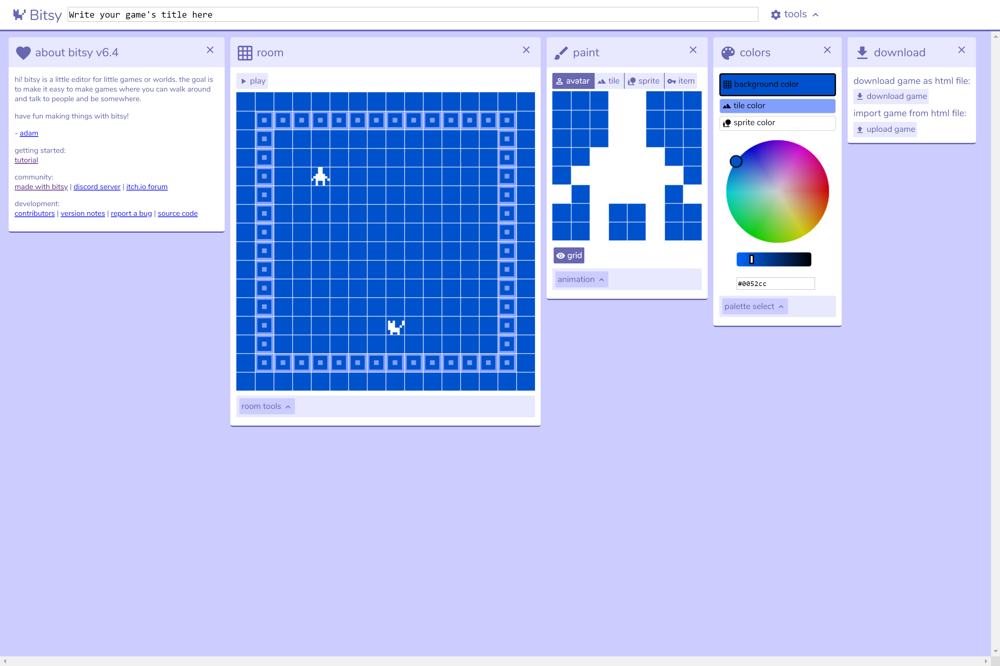

# Bitsy

This week, we'll be working with Bitsy, a tool that can be integrated into or linked to a Twine game. Bitsy is a surprising combination of simple and powerful: it embodies the playful practices of "creativity under constraints" we've started exploring through these time-limited, occasionally Dada-ist exercises this semester. At times you might find its limitations frustrating, but these constraints can also help you stick to the available time and keep your scope manageable.

The most important rule to keep in mind when working with Bitsy is "think small." As bee ulrich describes in [their article](https://medium.com/@cavegift/https-medium-com-cavegift-bitsy-is-a-tiny-toolset-4016814c5367) on the platform:

> *Where Odyssey feels like a tome, Bitsy games are poems. They’re handcrafted spaces with so little headroom that every last pixel is placed with purpose. Some do it so well they trick you into thinking you’re wandering a 3D dungeon, or cycling a radio through all the bad stations, or flipping through an informative textbook on moths.*

## Playing with Bitsy

You'll notice that Bitsy is focused on throwback-retro pixel art aesthetics. As an open-source project, the [editor for Bitsy](http://bitsy.org) is online and free.  Below is a screenshot of what you will be seeing as you get started: particularly note the "download" tools. Whenever you are using an online editor, you will want to immediately get in the habit of downloading the game as a .html file regularly to save your work. You can then import to continue.

Upon making the selection to create a new game in the platform (by clicking on the cat icon on the homepage), you will see a screen containing five sections, from left to right: 
- About: contains the same mission statement for the platform as well as helpful documentation for getting started with the platform
- Room: displays a 16 by 16 square that contains a human-shaped avatar and a cat-shaped sprite, along with buttons for selecting: edit, colors, tune, avatar, paint, pick, exits & endings, show/hide grid and show/hide walls
- Paint: an 8 by 8 grid where the designer can create avatars, sprites, tiles, and items 
- Colors: contains a color wheel and a place to enter a hex color code for the background color, tile color, and sprite color
- Download: allows the game designer to download the game as a sharable HTML file, as well as an option to import an existing game from an HTML file to edit in the space

The layout of Bitsy consists of a series of different sections that modify different aspects of the game, and the creator is not limited to these five items. When you are working on an aspect of the game that necessitates additional creative input, another section appears on the screen. For example, when a game creating edit and entry locations for a room in the game, as sixth editing field appears, allowing you to create and edit locations and transitions for room navigation.   

If you want to go further with a particular element of Bitsy, consider using this [tutorial video series](https://videlais.com/bitsy-tutorials/), which cover animation and conditional dialog in more detail than the demo we'll be working from in class.f you have more experience and are feeling limited by Bitsy, you can take a look at [Borksy](https://ayolland.itch.io/borksy) to expand your options. This is a set of "hacks," or prewritten scripts not unlike the ones we used for macros in Twine. Some of the options you might find particularly useful include dialog choices, a mult-sprite avatar, and character portraits.

To submit for credit in the in-class exercise, upload your exported .html file to GitHub Pages and share the link to the deployed version. Refer to our [demo](github.md) for the steps.