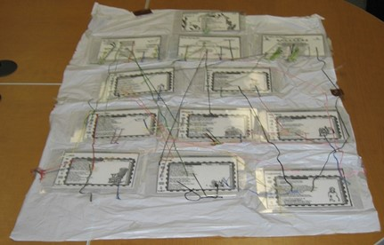

## Paper & String Prototype

Twine works in links and passages: links provide the navigation, while passages display the text and other elements for the reader to engage. To design your own hypertext using these foundational elements, you’ll need notecards, string, and tape. This method follows the example of Deena Larsen’s shower curtain (pictured above), an artifact now held in the MITH archives. By working with notecards and twine, you can plan out your idea and think about key decision points (the yarn acts the “twine” connecting passages). 

Mark one index card with a star – this will be the first screen your reader sees, so it should introduce the project and provide context for what follows. Links from that passage can move through linear sections (where passages must be seen to continue) or they can start branches (where readers might only see one possible route moving forward). 

Every passage should have a unique title: for simplicity, label your first card “Start.” You’ll use the titles to keep track of the links in your hypertext. Remember you’ll also need a name for your project.

Physically, the use of thread and tape between cards allows for some precision: you should tape your thread to the word, phrase, or choice might lead in one direction versus another. Build your prototype with the goal of having at least one complete path, with a sense of an ending and closure. Remember, all your index cards will need to be connected to something: a passage that doesn’t have a link in Twine will be completely inaccessible to the reader. 

Post a photo of your team's completed prototype to the Google folder, with all contributor's first initials and last names as the file name, to receive full credit for this in-class exercise.