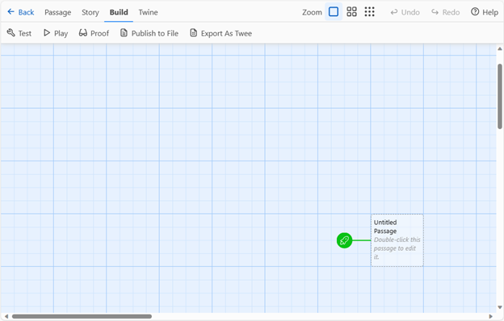
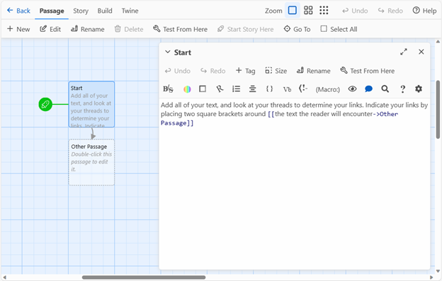

## Links and Passages

Today, we will be working in pairs through building working, playable versions of last week's prototypes.When you are using Twine on your own computer, you can download and install Twine by selecting “Download Desktop App” on the main menu. However, if you can’t install software on the computer you are using, you can select “Use in your browser” at [Twinery.org](https://twinery.org). 

Start by selecting “+New” to create a new project, and name it with the name of your project you decided on during the physical prototype. After you’ve typed and confirmed the name, the main editing screen (shown below) will load. Note that Twine isn’t a hosting service, so when you’re working online make sure to select the option to “Publish to file” (under “Build” in the story menu) frequently to save your work. 

There are several advanced options that you can ignore for now, including the choice of story format: stick with the default, Harlowe. Double click on the start passage (marked with the green rocket ship) to add the text of your first index card from the prototype. Select “Rename” to change to the title of your first card (Start) and type the contents of your first index card in the main editing box.

Next, add all the links to your Start passage by putting square brackets around the text you marked with your thread. Follow your threads on the physical prototype to check the names of the passages they linked to. Links will follow the syntax: **[[text to click on->Passage Name]]**

When you use this structure, the links will display the initial phrase (before the ->) and lead to the passage named in the second half of the link (after the ->). This will allow you to have different phrases link the reader to the same passage, as shown in this sample code:

- We might [[say one thing->phrase of significance]] and [[mean another->another passage]] – we can even include multiple links that appear different but lead to the [[same place->another passage]].

The editing interface also includes options to style your text (shown below): these work similarly to any text editor, with options for text styling, colors, and alignment. Try experimenting with those as you add in the rest of your index cards. Every time you add a link to a passage with a title you haven’t created yet, the passage will pop up with that title, as shown.

You can test the essay as you go by selecting “Play” under the Build menu (shown in figure 5.) When the project is complete, you can share it with others by selecting “Publish to File”: this will allow you to save a complete .html file, viewable in any browser. 

**Post the .html export of your team's completed prototype to the Moodle assignment to receive full credit for this in-class exercise.**